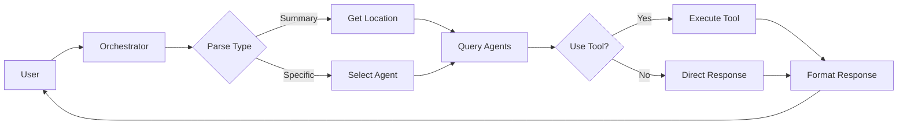

# AI Agents

[](https://www.python.org/downloads/)

An educational framework demonstrating agent orchestration patterns for building AI-powered assistants. This project showcases how to coordinate multiple specialized agents to handle user requests, manage context, and provide natural responses.

## 🚀 Features

- **Agent Orchestration**: Demonstrates coordination of multiple specialized agents
- **Context Management**: Handles location and conversation context
- **Specialized Agents**: 
  - Weather Agent: Provides weather information
  - Time Agent: Handles time-related queries
  - Clothing Agent: Gives clothing recommendations
- **Natural Interaction**: Formats responses from multiple agents into natural language
- **LLM Integration**: Supports multiple LLM providers for agent decision-making

## 📋 Prerequisites

- Python 3.8 or higher
- pip (Python package installer)
- Virtual environment (recommended)

## 🔧 Installation

1. Clone the repository:
```bash
git clone https://github.com/aashish1992/AI_Agents.git
cd AI_Agents
```

2. Create and activate a virtual environment:
```bash
python -m venv venv
source venv/bin/activate  # On Windows, use: venv\Scripts\activate
```

3. Install dependencies:
```bash
pip install -r requirements.txt
```

4. Set up environment variables:
```bash
cp .env.example .env
```
Edit `.env` with your API keys and configuration.

## 🎮 Quick Start

1. Create specialized agents:
```python
from src.agents import Agent
from src.tools import WeatherTool, TimeTool, ClothingTool

# Create weather agent
weather_agent = Agent(
    Name="Weather Agent",
    Description="Provides weather information",
    Tools=[WeatherTool()],
    Model="gpt-4"
)

# Create time agent
time_agent = Agent(
    Name="Time Agent",
    Description="Handles time-related queries",
    Tools=[TimeTool()],
    Model="gpt-4"
)
```

2. Set up the orchestrator:
```python
from src.orchestrator import AgentOrchestrator

# Create orchestrator with agents
orchestrator = AgentOrchestrator([
    weather_agent,
    time_agent
])

# Run the interactive assistant
orchestrator.run()
```


### Architecture Overview

The project follows a simple but effective architecture for agent orchestration:

1. **Base Agent**: Provides core functionality for all agents
   - Tool selection and execution
   - Conversation memory management
   - Input processing
   - Response formatting

2. **Orchestrator**: Coordinates multiple agents
   - Request type determination
   - Agent selection
   - Location context management
   - Response aggregation

3. **Tools**: Specialized functionality
   - Weather information
   - Time queries
   - Clothing recommendations

### System Flow

The following diagram illustrates the flow of information through the system:



#### Flow Description

1. **User Input Processing**
   - User sends a query to the Orchestrator
   - Orchestrator analyzes the input and determines request type
   - Request is classified as either summary or specific

2. **Agent Selection & Execution**
   - For summary requests: Orchestrator gets location and queries all relevant agents
   - For specific requests: Orchestrator selects and queries the most appropriate agent
   - Each agent processes the input and decides whether to use tools

3. **Response Generation**
   - If needed, agents execute their tools to gather information
   - Results are collected and processed
   - Orchestrator formats the response into natural language
   - Final response is returned to the user

## 🛠️ Development

The project structure is organized as follows:

```
src/
├── agents/         # Agent implementations
├── tools/          # Tool implementations
├── utils/          # Utility functions
├── llm/           # LLM integration
├── orchestrator.py # Agent coordination
└── main.py        # Application entry point
```

## 🤝 Contributing

We welcome contributions! Please:

1. Fork the repository
2. Create a feature branch
3. Make your changes
4. Test thoroughly
5. Submit a Pull Request

## 📝 License

This project has no active license.

## 🔮 Next Steps

1. Add more specialized agents
2. Implement agent-to-agent communication
3. Add memory persistence
4. Enhance response formatting
5. Add more tool integrations

## 🙏 Acknowledgments

- Thanks to all contributors who have helped shape this project
- Special thanks to the open-source AI community
- Built with support from various LLM providers

## 📊 Project Status

Current version: 0.1.0 (Alpha)

This project is under active development. While it's stable enough for experimental use, expect frequent updates and potential breaking changes until we reach v1.0.0. 